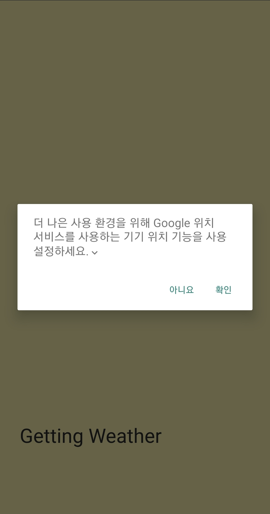
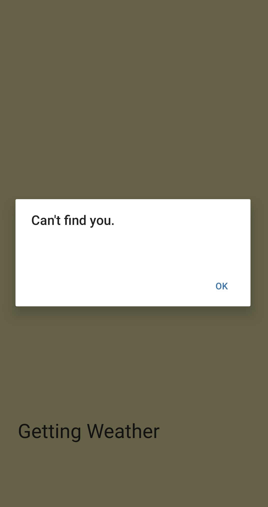
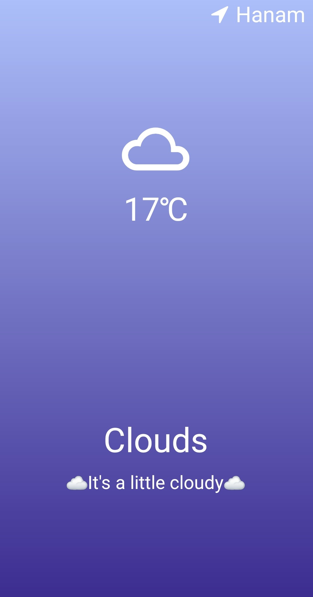

# weatherApp

<br />

Learning React Native by building a Foking Weather App

<br />

<p align="center"><p/>

[프로젝트 보기](https://expo.io/@jwonder/projects/weatherApp)

<br />

## **✔ 목표**

<br />

- weather API 활용
- expo를 통해 react native 빌드하기

<br />

## **사용기술**

<br />

- javascript
- reactnative
- 날씨 API (https://openweathermap.org/current)
- axios

<br />

## **주요기능 & 코드 리뷰**

<br />

```
주요 기능
- GPS(위치 정보) 받기
- 위치 정보를 통해 날씨 정보 제공
```

<br />

## **1. GPS(위치 정보) 받기**

<br />

### **코드 리뷰**

<br />

<p align="center">
  
  
<p/>

<br />

#### **App.js**

---

<br />

&nbsp; 사용자의 위치정보를 처리하여 전달합니다.

<br />

```js
getLocation = async () => {
  try {
    await Location.requestForegroundPermissionsAsync();
    const {
      coords: { latitude, longitude },
    } = await Location.getCurrentPositionAsync();
    this.getWeather(latitude, longitude);
  } catch (error) {
    Alert.alert("Can't find you.");
  }
};
```

<br />

> requestForegroyundPermissionAsync() 함수로 사용자의 GPS접근 권한을 요청합니다.
>
> getCurrentPositionAsync() 함수로 사용자의 위도와 경도 정보를 얻습니다.
>
> 위치 정보 처리 순서를 보장하기 위해 비동기적(async await)으로 요청합니다.
>
> 위도와 경도 변수를 통해 getWeather()함수를 호출합니다.

<br />

```js
getWeather = async (latitude, longitude) => {
  const {
    data: {
      main: { temp },
      weather,
      name,
    },
  } = await axios.get(
    `http://api.openweathermap.org/data/2.5/weather?lat=${latitude}&lon=${longitude}&appid=${API_KEY}&units=metric`
  );
  this.setState({
    isLoading: false,
    condition: weather[0].main,
    location: name,
    temp,
  });
};
```

<br />

> axios.get()을 이용해 weather api 데이터를 처리합니다.
>
> weather api에서 날씨, 온도, 현재 위치의 도시 이름에 대한 정보를 받습니다.
>
> api 정보를 받아서 setState에 저장하고 isLoading을 false로 업데이트합니다.

<br />

```js
  componentDidMount() {
    this.getLocation();
  }

  render() {
    const { isLoading, temp, condition, location } = this.state;
    return isLoading ? <Loading /> : <Weather temp={Math.round(temp)} condition={condition} location={location} />;
  }
```

<br />

> 컴포넌트를 이용해서 상태를 제어합니다.
>
> render로 시작시에 loading 화면을 보여주고 componentDidMount로 getLocation함수를 호출한 뒤 isLoading이 false로 변하면 weather.js로 날씨 정보를 전달합니다.

<br />

## **2. 위치 정보를 통해 날씨 정보 제공**

<br />

### **코드 리뷰**

<br />

<p align="center"><p/>

<br />

#### **weather.js**

---

<br />

&nbsp; api에서 받은 날씨 정보를 화면에 출력합니다.

<br />

```js
Weather.propTypes = {
  temp: PropTypes.number.isRequired,
  condition: PropTypes.oneOf([
    'Thunderstorm',
    'Drizzle',
    'Rain',
    'Snow',
    'Atmosphere',
    'Mist',
    'Smoke',
    'Haze',
    'Dust',
    'Fog',
    'Sand',
    'Ash',
    'Squall',
    'Tornado',
    'Clear',
    'Clouds',
  ]).isRequired,
  location: PropTypes.string.isRequired,
};
```

<br />

> propType을 선언하여 변수 입력값을 제한합니다.

<br />

```js
const weatherOptions = {
    Thunderstorm: {
        iconName: "weather-lightning",
        gradient: ["#BA8B02", "#181818"],
        title: "Thunderstorm",
        subtitle: "When thunder roars⚡, go indoors. Find a safe, enclosed shelter."
    },
    Drizzle: {
        iconName: "weather-rainy",
        gradient: ["#355C7D", "#6C5B7B", "#C06C84"],
        title: "Drizzle",
        subtitle: "Take an umbrella, it's raining☔"
    },

    ...(중략)

    Clear: {
        iconName: "weather-sunny",
        gradient: ["#f8b500", "#fceabb"],
        title: "Clear",
        subtitle: "☀Enjoy your day☀"
    },
    Clouds: {
        iconName: "weather-cloudy",
        gradient: ["#a8c0ff", "#3f2b96"],
        title: "Clouds",
        subtitle: "☁It's a little cloudy☁"
    }
}
```

<br />

> 화면에 출력할 정보들을 object에 저장했습니다.
>
> weather api에서 제공하는 날씨 데이터에 따라 다른 정보를 제공합니다.

<br />

```js
export default function Weather({ temp, condition, location }) {
  return (
    <LinearGradient
      colors={weatherOptions[condition].gradient}
      style={styles.container}
    >
      <StatusBar barStyle="light-content" />
      <View style={styles.header}>
        <FontAwesome name="location-arrow" size={28} color="white" />
        <Text style={styles.location}>{location}</Text>
      </View>
      <View style={styles.halfContainer}>
        <MaterialCommunityIcons
          name={weatherOptions[condition].iconName}
          size={96}
          color="white"
        />
        <Text style={styles.temp}>{temp}℃</Text>
      </View>
      <View style={{ ...styles.halfContainer, ...styles.textContainer }}>
        <Text style={styles.title}>{weatherOptions[condition].title}</Text>
        <Text style={styles.subtitle}>
          {weatherOptions[condition].subtitle}
        </Text>
      </View>
    </LinearGradient>
  );
}
```

<br />

> 처리한 날씨 정보를 통해 화면에 출력합니다.

<br />

## **마무리 소감**

<br />

> react native에 대해서 공부할 수 있는 기회였다.
> style을 css와 다르게 처리하는 방식이 익숙하지 않았다.
> expo를 통해서 쉽게 양쪽의 운영체제에 대한 어플리케이션을 빌드하고 관리할 수 있다는 점이 신선했다.
>
> API 문서를 확인하여 원하는 정보를 처리할 수 있게 되었고 컴포넌트 생명주기와 비동기적인 처리 방법을 학습할 수 있었다.
>
> expo의 도움을 받은 프로젝트이지만 expo를 사용하기위해 시간도 많이 들었다.
> expo를 사용하지 않고 react native 프로젝트를 하고싶다.
> 다음 번에는 제대로 앱 빌드에서 배포까지 해보고싶다.
>
> THANKS TO NOMADCODER, BAEGOFDA☺

<br />
